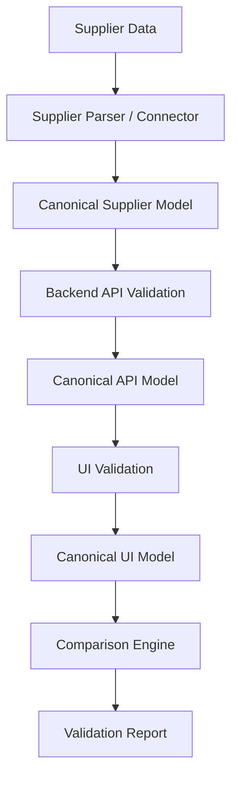
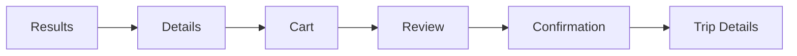
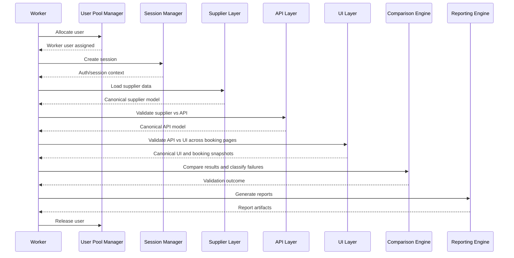

# Hotel Content & Pricing Validation Framework

Enterprise-grade High Level Design (HLD) for a Playwright + TypeScript framework that validates hotel content and pricing consistency across Supplier, Backend APIs, and UI layers for QAC2 and Production.

> Primary goal: identify whether a mismatch originated in supplier ingestion, backend processing, or frontend rendering, while also validating booking data continuity across the end-to-end funnel pages: Results, Details, Cart, Review, Confirmation, and Trip Details.

---

## 1. Overview

This framework is designed as a validation platform, not just a UI automation suite. It compares hotel content and pricing across three major layers:

```text
Supplier Data
   -> Supplier Parser / Connector
   -> Backend API Validation
   -> UI Validation
   -> Comparison Engine
   -> Validation Report
```

In addition, the UI journey is validated across the core booking funnel pages:

```text
Results -> Details -> Cart -> Review -> Confirmation -> Trip Details
```

The framework must automatically answer:

- Is supplier data correct?
- Is API data correct?
- Is UI data correct?
- Which layer failed?
- Who owns the failure?
- What exact values mismatched?
- Does the issue exist on Desktop?
- Does the issue exist on iPad?
- Does the issue exist on Mobile?
- At which booking page did the mismatch start?

---

## 2. Objectives

- Validate hotel content and pricing consistency across Supplier, API, and UI.
- Detect failures at the correct layer: Supplier, Backend, Frontend, or Multiple Layers.
- Validate end-to-end booking journey data continuity across Results, Details, Cart, Review, Confirmation, and Trip Details pages.
- Support QAC2 and Production environments.
- Support Desktop, iPad, and Mobile channels.
- Use isolated worker-level authentication with one user and one session per worker.
- Produce evidence-rich reports for fast defect triage.

---

## 3. Scope

### In Scope

- Supplier source validation from Excel, CSV, feed files, and supplier APIs.
- Backend API validation against supplier source data.
- UI validation against backend API data.
- E2E booking funnel validation across the six target pages.
- Channel-specific validation for Desktop, iPad, and Mobile.
- Data normalization, comparison, and mismatch classification.
- HTML, JSON, and CSV reporting.

### Out of Scope

- Pure visual regression as the primary objective.
- Performance or load testing.
- Security testing.
- General UI smoke coverage unrelated to hotel content or pricing consistency.
- Full business workflow automation outside hotel validation scenarios.

---

## 4. Key Business Problem

Hotel data can diverge across different system layers. A hotel record may be correct in supplier source data but transformed incorrectly in backend services, or the API may be correct while the UI displays stale or incorrect values.

A traditional E2E test can detect a failure, but it usually cannot answer where the failure originated. This framework solves that problem by validating each layer independently and then classifying the failure source.

---

## 5. Validation Architecture

## 5.1 End-to-End Validation Chain



## 5.2 Booking Funnel Validation Chain



---

## 6. Supported Channels

| Channel | Implementation Strategy | Notes |
|---|---|---|
| Desktop | Shared UI extraction implementation | Shared with iPad where possible |
| iPad | Shared UI extraction implementation | Same validation logic as Desktop |
| Mobile | Separate UI extraction implementation | Different source code and flow |

### Channel Principle

Only the UI extraction strategy changes by channel. Validation logic, comparison logic, reporting logic, and ownership classification remain common.

---

## 7. Core Validation Stages

### 7.1 Stage 1: Supplier Validation

Supplier source data is read from one of the following:

- Excel
- CSV
- Supplier feeds
- Supplier APIs

Example validated fields:

- Hotel name
- Address
- Amenities
- Room types
- Pricing
- Images
- Policies

Supplier data is parsed and normalized into a canonical model before comparison.

### 7.2 Stage 2: API Validation

The framework validates that backend APIs return expected supplier data.

Examples:

- Supplier Hotel Name = API Hotel Name
- Supplier Amenities = API Amenities
- Supplier Room Price = API Room Price

Purpose:

- Detect supplier ingestion issues
- Detect mapping issues
- Detect backend transformation issues

### 7.3 Stage 3: UI Validation

The framework validates that UI displays what APIs return.

Examples:

- API Hotel Name = UI Hotel Name
- API Price = UI Price
- API Amenities = UI Amenities

Purpose:

- Detect rendering issues
- Detect UI transformation issues
- Detect frontend defects

### 7.4 Stage 4: Booking Funnel Continuity Validation

The framework validates continuity of user-visible hotel and booking data across the following pages:

- Results
- Details
- Cart
- Review
- Confirmation
- Trip Details

This ensures the same hotel, room, dates, occupancy, pricing, policy, and booking details remain consistent as the user progresses through the booking funnel.

---

## 8. Page-Wise E2E Validation Model

| Page | Validation Focus |
|---|---|
| Results | Hotel card summary, displayed price, taxes snippet, room snippet, cancellation snippet, dates, occupancy |
| Details | Hotel name, address, gallery, amenities, room options, room pricing, room policies, selected dates and guests |
| Cart | Selected hotel and room, price breakdown, taxes and fees, promotions, traveler summary, cancellation policy |
| Review | Final booking summary, guest details, billing summary, payment summary, taxes, total payable |
| Confirmation | Booking ID, hotel name, room details, stay dates, guests, amount paid, payment status |
| Trip Details | Persisted booking data, booking ID, hotel details, dates, guests, paid amount, booking status |

### E2E Comparison Chain

The framework must compare page-to-page continuity using a normalized booking snapshot:

- Results -> Details
- Details -> Cart
- Cart -> Review
- Review -> Confirmation
- Confirmation -> Trip Details

---

## 9. Canonical Data Model

To avoid fragile comparisons, all three layers must be mapped into canonical models.

### 9.1 Canonical Hotel Model

```text
HotelRecord
- hotelId
- hotelName
- address
- geoLocation
- amenities[]
- roomTypes[]
- images[]
- policies[]
- pricing
- currency
- taxes
- sourceMetadata
```

### 9.2 Canonical Booking Snapshot Model

```text
BookingSnapshot
- hotelId
- hotelName
- roomType
- boardType
- checkInDate
- checkOutDate
- nightCount
- guestCount
- roomCount
- basePrice
- taxes
- fees
- discount
- totalPrice
- currency
- cancellationPolicy
- bookingId
- bookingStatus
- paymentStatus
```

These canonical models are used by the comparison engine across all stages and channels.

---

## 10. Shared Components

### 10.1 User Pool Manager

Responsibilities:

- Allocate users
- Track usage
- Release users

Rules:

- One user per worker
- No shared user session across workers
- Worker-safe allocation and release

### 10.2 Session Manager

Responsibilities:

- Create Site Manager session
- Refresh session when required
- Inject session into browser and API clients

Rules:

- One session per worker
- No shared authentication state
- Session lifecycle isolated to the worker

### 10.3 Supplier Validation Layer

Responsibilities:

- Read supplier sources
- Parse raw supplier data
- Normalize to canonical model
- Provide supplier validation input to API comparison layer

### 10.4 API Validation Layer

Responsibilities:

- Execute API requests
- Parse API responses
- Perform response contract validation
- Compare API data against supplier data

### 10.5 UI Validation Layer

Responsibilities:

- Extract data from each target page
- Normalize extracted UI data
- Compare UI data against API data
- Build booking snapshots per page

### 10.6 Comparison Engine

Responsibilities:

- Compare field values
- Apply normalization rules
- Apply pricing rules and tolerances if configured
- Classify mismatches
- Assign probable owner

### 10.7 Reporting Engine

Responsibilities:

- Produce validation summary
- Produce field-level mismatch details
- Produce page-transition mismatch details
- Attach evidence such as request payloads, responses, and screenshots

---

## 11. Failure Classification

### 11.1 Layer-Level Classification

| Supplier vs API | API vs UI | Result | Failure Layer | Owner |
|---|---|---|---|---|
| Match | Match | PASS | None | None |
| Mismatch | Match | Backend Data Issue | Supplier / Backend | Supplier Team, Backend Team |
| Match | Mismatch | Frontend Issue | Frontend | UI Team |
| Mismatch | Mismatch | Multiple Layer Failure | Multiple Layers | Supplier Team, Backend Team, UI Team |

### 11.2 Booking Funnel Transition Classification

| Transition | Meaning |
|---|---|
| Results != Details | Search results summary differs from details page |
| Details != Cart | Selected room or price changed while adding to cart |
| Cart != Review | Cart data did not carry correctly to review page |
| Review != Confirmation | Final confirmed data differs from reviewed booking data |
| Confirmation != Trip Details | Persisted trip record differs from booking confirmation |

---

## 12. Comparison Rules

| Field Type | Comparison Strategy |
|---|---|
| Hotel Name | Trim, normalize spaces, case-insensitive compare |
| Address | Normalize punctuation and abbreviations |
| Amenities | Order-insensitive set comparison |
| Room Types | Key-field comparison using canonical room identifiers |
| Pricing | Numeric comparison with currency and tax awareness |
| Policies | Text normalization or key policy token extraction |
| Images | Normalized URL or count-based validation depending on use case |
| Dates | Compare normalized date format |
| Occupancy | Compare adults, children, rooms, and guest count |
| Booking ID / Status | Exact match |

---

## 13. Playwright-Based Execution Strategy

Each worker executes with isolated test data and session state.



### Execution Rules

- Allocate one user per worker.
- Create one session per worker.
- Reuse worker session only within the same worker.
- Do not share browser storage state across workers.
- Run Desktop, iPad, and Mobile as separate Playwright projects.
- Run QAC2 and Production through environment-specific configuration.

---

## 14. Repository Structure

```text
hotel-validation-framework/
├── README.md
├── package.json
├── tsconfig.json
├── playwright.config.ts
├── config/
│   ├── env/
│   │   ├── qac2.ts
│   │   └── prod.ts
│   ├── users/
│   └── suppliers/
├── src/
│   ├── core/
│   │   ├── fixtures/
│   │   ├── session/
│   │   ├── user-pool/
│   │   ├── logger/
│   │   └── config/
│   ├── supplier/
│   │   ├── adapters/
│   │   ├── parsers/
│   │   ├── mappers/
│   │   └── models/
│   ├── api/
│   │   ├── clients/
│   │   ├── validators/
│   │   ├── contracts/
│   │   └── mappers/
│   ├── ui/
│   │   ├── desktop/
│   │   ├── ipad/
│   │   ├── mobile/
│   │   ├── pages/
│   │   │   ├── results.page.ts
│   │   │   ├── details.page.ts
│   │   │   ├── cart.page.ts
│   │   │   ├── review.page.ts
│   │   │   ├── confirmation.page.ts
│   │   │   └── trip-details.page.ts
│   │   ├── extractors/
│   │   └── models/
│   ├── comparison/
│   │   ├── comparators/
│   │   ├── classifiers/
│   │   ├── normalizers/
│   │   └── rules/
│   ├── reporting/
│   │   ├── builders/
│   │   ├── exporters/
│   │   └── templates/
│   └── shared/
│       ├── models/
│       ├── constants/
│       └── utils/
└── tests/
    ├── supplier/
    ├── api/
    ├── e2e/
    └── regression/
```

---

## 15. Page Object and Validator Strategy

### Page Objects

Each booking page should have a dedicated page object responsible for:

- Page actions
- Locator definitions
- UI data extraction
- Page-level synchronization

### Validators

Validators should remain outside page objects and should be responsible for:

- Supplier vs API comparison
- API vs UI comparison
- Page-to-page booking snapshot comparison
- Ownership classification
- Reportable mismatch generation

This separation ensures page objects stay maintainable while business validation logic remains reusable.

---

## 16. Reporting Model

### 16.1 Layer Validation Report

| Field | Supplier | API | UI | Result | Failure Layer | Owner |
|---|---|---|---|---|---|---|
| Hotel Name | ABC Hotel | ABC Hotel | ABC Hotel | PASS | None | None |
| Price | 5000 | 5200 | 5200 | FAIL | Backend Data Issue | Supplier Team, Backend Team |
| Amenities | Pool | Pool | Gym | FAIL | Frontend Issue | UI Team |

### 16.2 Booking Funnel Transition Report

| Transition | Field | Previous Page Value | Current Page Value | Result | Probable Owner |
|---|---|---|---|---|---|
| Results -> Details | Price | 5000 | 5000 | PASS | None |
| Details -> Cart | Room Type | Deluxe King | Deluxe Twin | FAIL | Frontend / Backend selection issue |
| Review -> Confirmation | Total Price | 6500 | 6800 | FAIL | Pricing / Checkout defect |
| Confirmation -> Trip Details | Booking Status | Confirmed | Pending | FAIL | Backend persistence / UI sync issue |

### 16.3 Evidence Pack

Each failure should capture:

- Hotel ID
- Environment
- Channel
- Worker ID
- Page name or transition
- Supplier raw value
- API raw value
- UI raw value
- Screenshot
- Request/response evidence
- Timestamp

---

## 17. Non-Functional Requirements

### Reliability

- No shared users across workers
- No shared sessions across workers
- Stable session refresh handling
- Robust retry only for transient infrastructure issues

### Maintainability

- Clear module boundaries
- Reusable canonical models
- Centralized comparison rules
- Channel-specific UI extraction isolated from business validation logic

### Scalability

- Parallel execution using worker isolation
- Config-driven supplier onboarding
- Channel-based project execution
- Environment-driven configuration

### Traceability

- Every mismatch must be traceable to the exact layer or page transition
- Reports must include enough evidence to avoid manual debugging in most cases

---

## 18. Assumptions

- Supplier data can be accessed in a stable and parseable format.
- Required backend APIs are accessible in QAC2 and Production.
- Test users are provisioned and can be safely pooled.
- Site Manager session API supports worker-level session creation.
- Desktop and iPad share enough UI structure to reuse extraction logic.
- Mobile has distinct UI behavior and requires its own extraction implementation.

---

## 19. Success Criteria

The framework will be considered successful when it can automatically determine:

1. Whether supplier data is correct.
2. Whether backend API data matches supplier data.
3. Whether UI data matches backend API data.
4. Which layer failed.
5. Who owns the failure.
6. Which exact values mismatched.
7. Whether the issue occurs on Desktop.
8. Whether the issue occurs on iPad.
9. Whether the issue occurs on Mobile.
10. On which booking page or transition the data mismatch began.

---

## 20. Future Enhancements

- Contract testing integration for backend APIs
- Historical mismatch trend dashboards
- Supplier-specific onboarding templates
- Slack or email alerting for critical regressions
- Defect tracker integration for automatic ticket creation
- Snapshot diff visualization for pricing and booking transitions

---

## 21. Summary

This framework is an enterprise validation solution built to trace hotel content and pricing issues across Supplier, API, and UI layers while also validating data continuity across the booking journey pages: Results, Details, Cart, Review, Confirmation, and Trip Details.

Its core strength is actionable mismatch diagnosis: it not only detects failures but also identifies where they originated, what changed, who likely owns the issue, and on which channel or booking stage the inconsistency first appeared.
